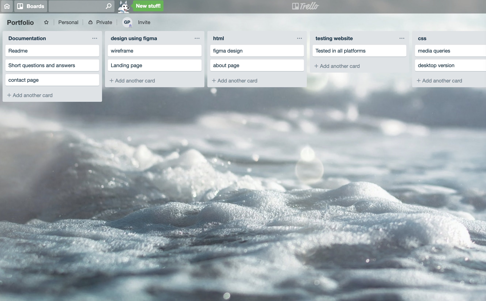

# link (URL)
https://github.com/pathakg028/portfolio

# github repository

https://github.com/pathakg028/portfolio

# Description of your portfolio website, including,

# Purpose

The main purpose of portfolio website is to demonstrate my skills, projects, work experience and interests to the recruiters and people around the world.

# Functionality / features

1. Users can access my portfolio website in any available platform like Iphone, ipad, mobile, desktop in both portrait and landscape view.

2. Users can contact me just by completing one form

3. Users can visit my linkedIn, github, facebook, twitter profile just by clicking on the icons in the footer.

# Sitemap
# Screenshots
# Target audience
My target audience is mainly Employers and web developers.
# Tech stack (e.g. html, css, deployment platform, etc)

Design part is done in Figma. Technlogy used is HTML, CSS. I created repository in github and code is pushed for future references.

# Design documentation including,
# Design process
I did online research and shortlisted few designs first and then color theme.
# Wireframes
I drew wireframe on paper first and then created on figma.

# Usability considerations

1. I Picked Purple and Light blue color theme so that users can enjoy my website more.

2. Users can visit my portfolio in any available platform.

3. I used Montserrat font to make text more readable.

4. Users can visit my linkedIn, twitter and facebook profile just by clicking on icons in the footer.

# Details of planning process including,
# Project plan & timeline

I divided my task in 4 parts
1. Designing and wireframing using Figma (1day)
2. Desktop coding first (1Day)
3. Mobile and other platform by writing media queries (1day)
4. Testing and Documentation (1day)

# Screenshots of Trello board(s)

# key events in the development of the internet from the 1980s to today

key events in the development of the internet are as follows: 

1980s: Radia Perlman creates the Spanning Tree algorithm

1983: The Domain Name System (DNS) institutes the .host names we are now familiar with such as .com, .gov., .edu, etc.

1985: Symbolics Computer Corp., originally a manufacturer of single-user computers and software, becomes the very first registered domain name.

1990: HyperText Markup Language (HTML), Uniform Resource Identifier (URI, more commonly known as URL) and Hypertext Transfer Protocol (HTTP).

1991: The world wide web is open for business

1995: eCommerce begins

1999: Craig Newmark founds the infamous eCommerce beast Craigslist.

2004:
1. Feb. 4, 2004, Facebook launches but only college students are allowed to join.
2. Mozilla announces the launch of Mozilla Firefox.

2005: The go-to hub of Vine videos emerges: YouTube.com

2006:
1. Twitter launches.
2. Facebook opens its eDoors to everyone.

# Define and describes the relationship between fundamental aspects of the internet such as: domains, web servers, DNS, and web browsers (max. 150 words)

A server hosts information. An IP address is associated with that server. A DNS points you towards the IP address the server is on. AN ISP provides a gateway to the rest of the internet, that the DNS server is in charge of directing. A Browser communicates with your devices’ network access chip, and then to the ISP. A user creates information or accesses information through this browser.

# Reflect on one aspect of the development of internet technologies and how it has contributed to the world today (max. 150 words)

The biggest Positive impact of the internet on society is the popularity of social networks and social media websites. Societies around the globe are becoming stronger, developed and more intelligent because most technologies are interlinked with the internet.

Internet added values in the people’s life and the way we introduce each other and communicate for shared life, career and business values.  The Internet removes the geographical barriers between people. Societies are getting inspired by each other. And the biggest positives that slowly but definitely societies breaking the Superstition, conservatism and cultural egos.

# introduction

A junior developer, I originally studied Mtech (Information Technology) from Swinburne universities Melbourne. 
I worked in a Digital Agency (APD) as a Traffic Executive.

I am very fond of learning new things specially web development. So I have shifted my focus toward 
transitioning into a career in full-stack web development. I am currently undertaking the Coder Academy Bootcamp at the Academy of Information Technology. 
I'm always looking to explore new opportunities and work with passionate, creative people.